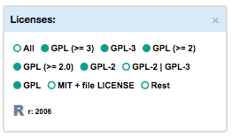

# BitQuery VA-App - Legend

A legend component for BitQuery VA-App: *zoom and filter*. 
Creates interactive legends which enable to filter and project certain parts of data according to various parameters.

Legend types: Clusters, Licences, Task views, Layout settings, Control legend.

  

  

## License

Apache License 2.0
